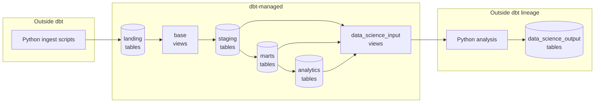

# Schema design charter

> Historical design note. Active dbt implementation and documentation now live in
> [the Citadel](https://github.com/dangroshan-wnd/the-citadel); active ingestion lives in
> [the Wasteland](https://github.com/dangroshan-wnd/the-wasteland/tree/main/pj__fantasy-football-ingestion).

This document describes the **target** layering for the project. Some layers are not fully wired yet (e.g. `staging` may still read from seeds while `landing` ingest is brought online). That gap is expected during migration.

## Layer flow
`ctrl + shift + v` to render

---

## Layers

### schema: landing
- Materialization: `table`
- Holds raw data from various sources, usually in JSONB format.
- Some helper columns may be appended but only if required for ingest logic (e.g. to easily skip previously loaded records)
- Gold standard example: `landing.ud_draft_entries` (from `ingest__ud__draft_entries.py`)
  - Naming style: `fantasy_football.landing.<source_abbreviation>_<source_table_name>`

### schema: base
- Materialization: `view`
- Selects from `landing` only.
- No transformations outside of splitting the JSONB into columns with explicit type-casting.
- Gold standard example: TBD
- Naming style (dbt model): TBD

### schema: staging
- Materialization: `table`
- Selects from `base` only.
- Applies **structural / column-level tests** here (e.g. `unique`, `not_null` on a single model).
  - No tests allowed in earlier layers.
- Can apply de-duping here if needed.
  - No de-duping allowed in earlier layers.
- Can re-name columns for clarity.
- Gold standard example: TBD
- Naming style (dbt model): TBD

### schema: marts
- Materialization: `table`
- Selects from `staging` only.
- Can combine sources
  - No combining allowed in earlier layers.
- Can create new derived fields (boolean flags, logic fields, etc.)
- Holds **cross-model / business-logic tests** as needed (e.g. relationships, accepted values tied to business rules).
- Gold standard example: TBD
- Naming style: TBD

### schema: analytics
- Materialization: `table`
- Selects from `marts` by default.
  - `staging` should not be a routine upstream for `analytics`; use `marts` unless the model is a thin pass-through or explicitly exploratory.
- Intended to be the primary schema for visualizations and data-science-oriented tables.
- High-complexity source combinations, aggregations, etc. should usually live in `analytics` while low-complexity joins may live in `marts`.
- Gold standard example: TBD
- Naming style: TBD

### schema: data_science_input
- Materialization: `view`
- Selects from `staging`, `marts`, or `analytics`
- Used as a narrow, purpose-built input for downstream Python analysis.
- Gold standard example: TBD
- Naming style: TBD

### schema: data_science_output
- Materialization: `table`
- Written **directly by Python** (not built by dbt).
- Holds results produced from a `data_science_input` (or related tables) after Python transformation/analysis.
- **Outside dbt lineage** — dbt will not `ref()` these tables; document inputs/outputs in Python or project docs instead.
- Gold standard example: TBD
- Naming style: TBD
